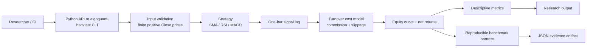
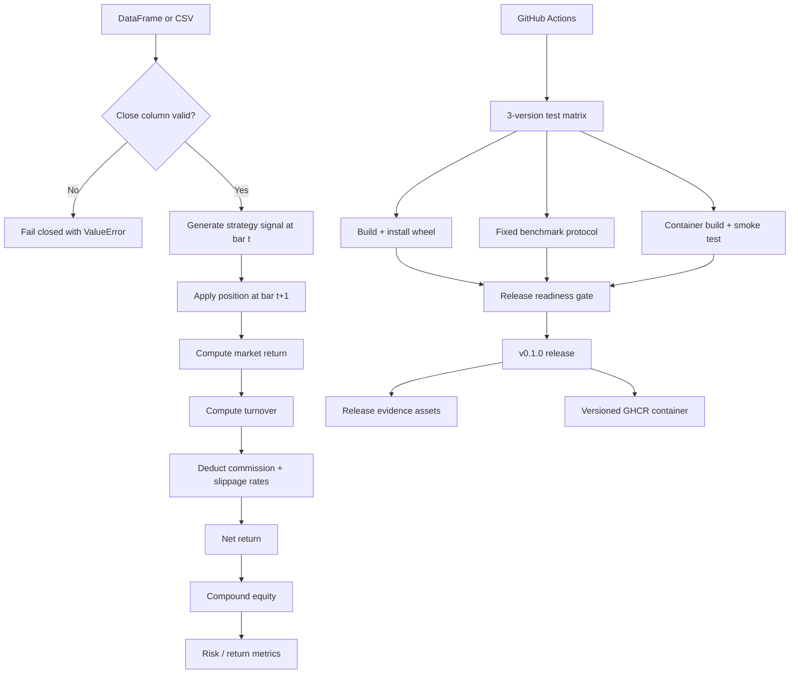

# AlgoQuant Backtester — Reproducible Quant Research Toolkit

[](https://github.com/CoreyLeath-code/Algo-Quant-Backtester-/actions/workflows/ci.yml)
[](https://github.com/CoreyLeath-code/Algo-Quant-Backtester-/actions/workflows/codeql.yml)
[](https://github.com/CoreyLeath-code/Algo-Quant-Backtester-/releases/latest)
[](pyproject.toml)
[](LICENSE)
[](https://github.com/CoreyLeath-code/Algo-Quant-Backtester-/pkgs/container/algo-quant-backtester)

AlgoQuant Backtester is a compact Python research toolkit for deterministic bar-based strategy simulation. The v0.1 release contract is intentionally narrower than the repository's older portfolio language: the verified core provides one-bar-lagged execution, explicit turnover costs, reference SMA/RSI/MACD strategies, descriptive risk/return metrics, a reproducible synthetic benchmark, fail-closed CI, Python distributions, and a versioned container package.

> **Evidence boundary:** this repository is a research simulator. It does not provide broker/exchange connectivity, an order-management system, market-impact modeling, live trading authorization, guaranteed profitability, a hard real-time SLA, or a production LLM risk engine. The legacy `agents/` prototype uses a mocked analyst path; it is not a live Claude integration.

## What is implemented and verified

| Surface | v0.1 contract |
|---|---|
| Backtest execution | Vectorized bar returns with strategy signals applied one bar later to avoid same-bar execution look-ahead |
| Costs | Commission + slippage expressed as decimal return rates per unit of position turnover |
| Strategies | SMA crossover, RSI thresholds, and MACD crossover reference implementations |
| Metrics | Total return, CAGR, annualized volatility, Sharpe, Sortino, max drawdown, Calmar, win rate, profit factor, expectancy |
| Reproducibility | Fixed-seed synthetic benchmark with runtime versions, commit SHA, warm-up/sample counts, p50/p95/p99 latency, throughput, and traced memory |
| CI | Python 3.10/3.11/3.12 tests, fail-closed coverage gate, lint/compile checks, wheel install smoke test, benchmark artifact, container smoke test |
| Release | Wheel, sdist, source archive, benchmark JSON, SHA-256 checksums, CycloneDX SBOM, GitHub Release, and GHCR image |

## Architecture flowchart



The release-critical path is deliberately in-process and deterministic. Network services, notebooks, experimental agents, Terraform, Helm, and legacy ML files are outside the v0.1 correctness/performance claim unless a workflow explicitly validates them.

## System design flowchart



## Quick start

### Prerequisites

- Python 3.10–3.12
- Git
- Docker only if you want to run the container package

```bash
# Clone
git clone https://github.com/CoreyLeath-code/Algo-Quant-Backtester-.git
cd Algo-Quant-Backtester-

# Create an isolated environment
python -m venv .venv
source .venv/bin/activate        # Windows PowerShell: .venv\Scripts\Activate.ps1

# Install the canonical package + test/build tooling
python -m pip install --upgrade pip
python -m pip install -e ".[dev]"

# Verify the release-critical core
python -m pytest tests -v --cov=algoquant --cov-config=.coveragerc --cov-report=term-missing
ruff check algoquant tests

# Run a deterministic demo
algoquant-backtest --rows 1000 --seed 20260828

# Generate benchmark evidence
python -m algoquant.benchmark \
  --rows 5000 \
  --iterations 50 \
  --warmups 5 \
  --seed 20260828 \
  --output benchmark-results.json
```

Or run the full local evidence contract:

```bash
make reproduce
```

### Python API

```python
import pandas as pd
from algoquant import Backtester, SMAStrategy

market = pd.DataFrame({"Close": [100, 101, 102, 99, 103, 105] * 20})
engine = Backtester(
    data=market,
    strategy=SMAStrategy(short_window=5, long_window=20),
    commission=0.0005,  # 5 bps per unit turnover
    slippage=0.0002,    # 2 bps per unit turnover
)
results = engine.run()
print(engine.get_metrics())
```

## Reproducibility contract

The benchmark is designed to answer one narrow question: **how long does this implementation take to run the same deterministic synthetic bar-backtest workload on a documented runner?** It is not a trading-performance study.

Fixed protocol:

- seed: `20260828`;
- synthetic price rows per backtest: `5,000`;
- reference strategy: long-only SMA `(20, 50)`;
- commission: `0.0005` per unit turnover;
- slippage: `0.0002` per unit turnover;
- warm-ups: `5`;
- measured backtests: `50`;
- timing: `time.perf_counter_ns()` around the in-process `Backtester.run()` call;
- memory: Python `tracemalloc` peak during measured iterations;
- environment: Git SHA, Python, OS/platform, NumPy, and pandas versions embedded in JSON;
- exclusions: network, external market-data I/O, broker/exchange calls, dashboards, concurrent clients, cloud deployment, and live execution.

The CI workflow uploads `benchmark-results.json` for every validated branch/PR run. Tagged v0.1.0 release evidence also attaches the benchmark JSON to the GitHub Release.

## Research-style benchmark and metrics

**Source of record:** [`benchmarks/latest.json`](benchmarks/latest.json), copied byte-for-byte from the validated GitHub Actions benchmark output for CI run `33195578260` (artifact `9695616098`). The release workflow re-runs the same protocol and attaches a fresh `benchmark-results.json` to v0.1.0.

| Measurement | Verified CI value |
|---|---:|
| Test result | 11/11 passed on Python 3.11; matrix also passed on 3.10 and 3.12 |
| Core coverage | 84.65% (215 statements, 33 missed; 80% fail-closed gate) |
| Median backtest latency | 11.229583 ms |
| p95 backtest latency | 12.038690 ms |
| p99 backtest latency | 12.477608 ms |
| Backtests / second | 87.537929 |
| Rows / second | 437,689.646 |
| Peak traced Python memory | 2.231567 MiB |
| Benchmark workflow SHA | `b88a8e7f6c7fdd7bfa89b330c8b7ab204a554b5b` (PR merge ref for feature head `3e65de7181bf6af3d63d5607d78697adecc82ca1`) |

The same seeded workload records this deterministic result snapshot: total return `0.07090041`, CAGR `0.00345836`, annualized volatility `0.11315564`, Sharpe `0.08707647`, Sortino `0.12426827`, max drawdown `-0.29519530`, Calmar `0.01171549`, win rate `0.49197462`, profit factor `1.01922218`, and mean-bar expectancy `0.00003910`. These values are regression evidence for the seeded synthetic workload, **not** evidence of alpha, profitability, forecasting accuracy, or investment suitability.

Metric definitions and interpretation limits are documented in [`metrics.md`](metrics.md).

## Execution assumptions

The current engine intentionally makes its assumptions visible:

1. **Bar close inputs:** the canonical contract requires finite, strictly positive `Close` prices.
2. **No same-bar execution:** a signal generated on bar `t` becomes the position for bar `t+1`.
3. **Simplified costs:** commission and slippage are return-rate costs per unit turnover; there is no spread model, market impact, order book, partial fill, or liquidity constraint.
4. **Position bounds:** strategy outputs are clipped to `[-1, 1]`.
5. **No leverage/margin engine:** the backtester does not model margin calls, borrow availability, financing, or exchange-specific rules.
6. **Descriptive metrics:** risk/return statistics summarize the simulated path and are not statistical proof of future performance.

## Release and package contract

v0.1.0 publishes only after the release commit re-runs compilation/lint, tests, the coverage gate, package build, and the fixed benchmark. A successful release publishes:

- `algoquant_backtester-0.1.0-py3-none-any.whl`;
- source distribution;
- deterministic Git source archive;
- `benchmark-results.json`;
- `SHA256SUMS`;
- `sbom.cdx.json`;
- GHCR images `ghcr.io/coreyleath-code/algo-quant-backtester:0.1.0` and `:latest`.

Container example after the release is published:

```bash
docker pull ghcr.io/coreyleath-code/algo-quant-backtester:0.1.0
docker run --rm ghcr.io/coreyleath-code/algo-quant-backtester:0.1.0 --rows 1000 --seed 20260828
```

## L6 audit findings addressed in v0.1

The hardening pass corrected several high-impact credibility and correctness issues present in the earlier repository state:

- removed unsupported claims of institutional-grade scale, 45k ticks/sec, hard sub-5 ms risk guarantees, zero race conditions, and a live Claude 3.5 Sonnet risk engine;
- replaced fail-open CI steps with fail-closed testing and evidence gates;
- normalized the canonical Python package so imports, tests, wheels, and containers use the same code path;
- corrected Sharpe annualization that previously divided by already-annualized volatility;
- replaced an unused slippage calculation with an explicit turnover-based cost model;
- made the one-bar signal/execution lag explicit to prevent same-bar look-ahead execution;
- replaced placeholder benchmark echo statements with an executable fixed-seed benchmark harness;
- replaced the broken Docker entry point with a packaged CLI smoke-tested in CI;
- removed stale CI/deployment workflows that reported success without validating the claimed behavior.

## Extended Q&A

### Is this an institutional-grade or production-authorized trading system?

No. It is a portfolio/research backtesting toolkit. A production trading stack would require venue adapters, an order-management/execution-management layer, market-data quality controls, reconciliation, durable state, authentication/authorization, secrets management, operational SLOs, disaster recovery, compliance controls, and extensive deployment-specific validation.

### Does the repository integrate Claude 3.5 Sonnet?

Not in the v0.1 release contract. The legacy `agents/` prototype contains a mocked method that returns fixed analyst text. The README no longer represents that mock as a live Anthropic integration.

### Does the circuit-breaker prototype guarantee sub-5 ms risk isolation?

No. A user-space Python timing check cannot establish a hard real-time guarantee. The v0.1 benchmark measures the backtester under a documented development protocol and reports observed percentiles without turning them into an SLA.

### How is look-ahead bias handled?

The engine shifts generated strategy signals by one bar before applying them as positions. That prevents a signal derived from bar `t`'s close from earning bar `t`'s return. This does not eliminate every possible research leakage source; feature engineering, universe selection, survivorship, corporate actions, and dataset construction remain the researcher's responsibility.

### What exactly do commission and slippage mean?

They are decimal return-rate costs multiplied by absolute position turnover. For example, `commission=0.0005` and `slippage=0.0002` impose 7 bps when turnover is `1.0`. This is intentionally simple and should not be confused with a calibrated execution-cost model.

### Are the benchmark strategy returns proof the strategy works?

No. The benchmark uses seeded synthetic prices. Return/risk metrics are deterministic regression snapshots used to detect code changes. They provide no evidence of alpha or live profitability.

### Why publish p50/p95/p99 instead of a single fastest timing?

Latency distributions are more reproducible and honest than best-case timings. Warm-ups and a fixed measured sample count reduce startup noise, while the JSON artifact records the runner environment and exact commit.

### What is included in the Python package?

The supported package is `algoquant`: `Backtester`, `Metrics`, `SMAStrategy`, `RSIStrategy`, `MACDStrategy`, the deterministic demo CLI, and the benchmark harness. Older exploratory files remain outside the public v0.1 contract unless migrated and tested later.

### Why keep legacy research/ML/infrastructure directories?

They document earlier experimentation, but presence in the repository is not evidence that those paths are release-ready. v0.1 narrows the supported surface instead of inflating claims around unvalidated components.

### What should be built next?

Highest-value follow-ups are an explicit trade/fill ledger, benchmark confidence intervals across repeated runner executions, richer transaction-cost models, walk-forward and leakage tests, fixture-backed historical datasets with hashes, property-based tests for accounting invariants, and validated infrastructure/deployment manifests.

## Engineering roadmap

- **v0.1.x:** strengthen property/invariant tests, improve trade-ledger semantics, and pin reproducibility fixtures.
- **v0.2:** add versioned historical-data fixtures, walk-forward evaluation helpers, and statistical uncertainty reporting.
- **v0.3:** add calibrated spread/impact models and explicit fill/trade accounting.
- **Later:** validate optional service/deployment surfaces separately; do not merge cloud/runtime claims into the core benchmark without end-to-end evidence.

## License

MIT. See [`LICENSE`](LICENSE).
